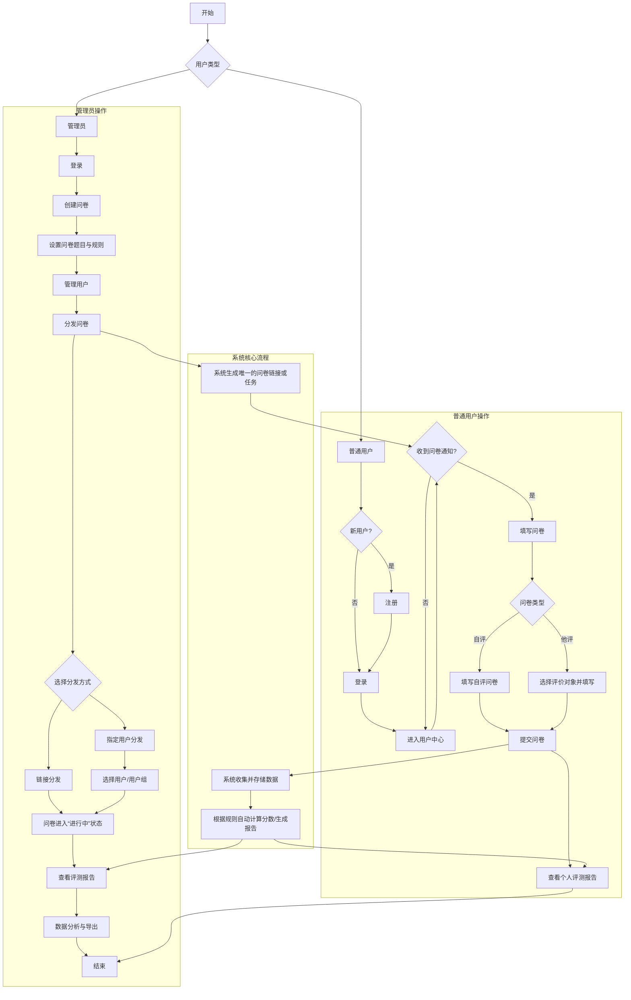

好的，这是一个使用 Mermaid 格式为您设计的问卷填写软件系统的关键步骤流程图。该流程图涵盖了用户、管理员、注册分发、评测生成、自评和他评等核心功能模块。

### 问卷填写软件系统流程图 (Mermaid 格式)

### 流程图说明

这个流程图主要分为三个部分：**管理员操作**、**普通用户操作** 和 **系统核心流程**。

1.  **管理员操作 (Admin Operations):**
    *   管理员负责整个系统的核心管理功能。
    *   流程从 **登录** 开始，然后可以 **创建问卷** 并 **设置** 详细的题目和规则（例如，是否允许匿名、评分标准等）。
    *   管理员拥有 **用户管理** 权限，可以添加、删除或分组用户。
    *   最重要的环节是 **分发问卷**，管理员可以选择通过 **公开链接** 的方式分发，也可以 **指定** 给特定的用户或用户组。
    *   问卷分发后，管理员可以实时 **查看评测报告**，进行 **数据分析和导出**。

2.  **普通用户操作 (User Operations):**
    *   新用户需要先 **注册**，已注册用户直接 **登录**。
    *   登录后进入用户中心，系统会提示收到的问卷通知。
    *   用户打开问卷，系统会判断是 **自评** 还是 **他评** 问卷。
        *   **自评**：用户直接对自己进行评价。
        *   **他评**：用户需要先选择要评价的对象（例如，同事、下属），然后进行评价。
    *   完成并 **提交问卷** 后，用户可以 **查看** 自己权限范围内的个人评测报告。

3.  **系统核心流程 (System Core Process):**
    *   这是一个后台流程，展示了系统如何处理数据。
    *   当管理员分发问卷时，系统会 **生成相应的任务或链接**。
    *   用户提交问卷后，系统负责 **收集和存储** 所有答题数据。
    *   随后，系统会根据预设的规则 **自动计算得分并生成评测报告**。
    *   生成的报告会分别推送给管理员和（根据权限设置）普通用户。
