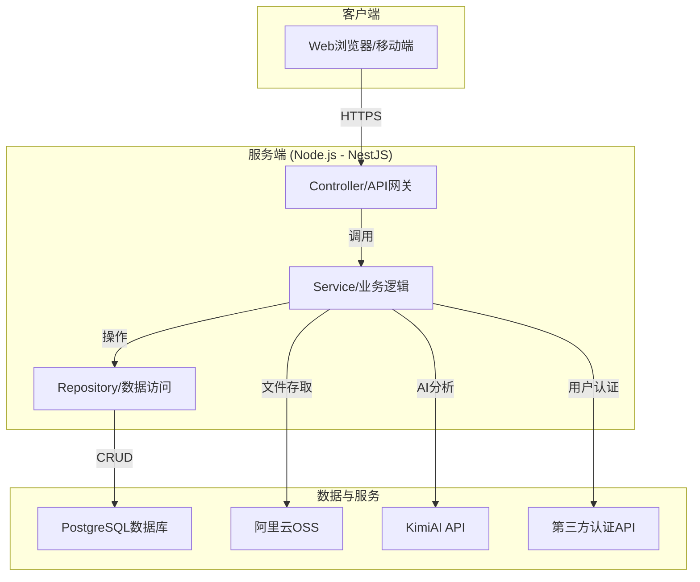
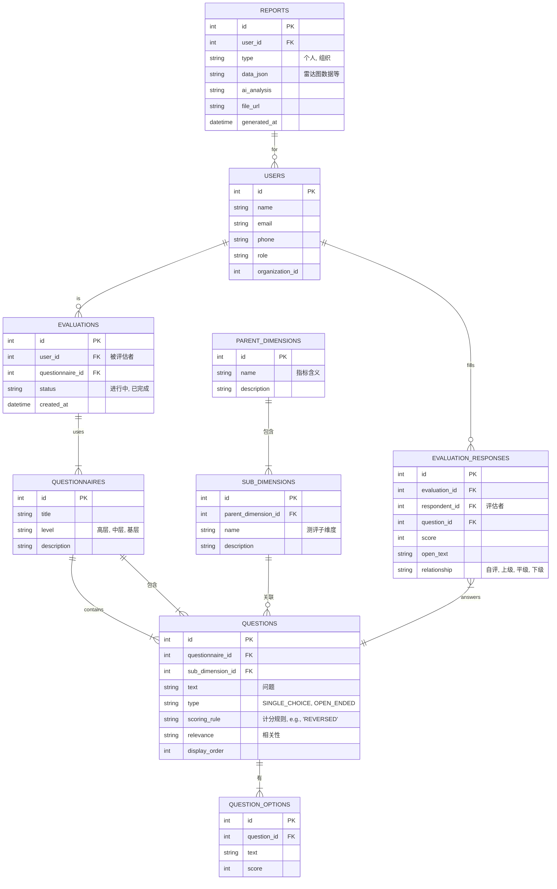

# **组织领导力诊断系统 - 软件开发设计文档**

## 1. 引言

### 1.1. 项目概述
本文档旨在根据《组织领导力诊断系统 - 软件开发需求文档》的要求，提供一个全面的软件开发设计方案。该系统旨在通过360度评估，为企业提供一个识别、分析和提升各层级管理者领导力的工具。

### 1.2. 范围
本设计涵盖了系统的技术架构、数据库结构、模块化功能实现、API接口设计以及非功能性需求的实现策略。

---

## 2. 系统架构

### 2.1. 架构图

### 2.2. 技术选型
- **前端**: `Vue3` + `TypeScript` + `Vite` - 提供强大的类型支持和高效的开发体验。
- **后端**: `Node.js` (`NestJS` 框架) - 基于 `TypeScript`，架构清晰，易于扩展和维护。
- **数据库**: `PostgreSQL` - 强大的关系型数据库，支持复杂的查询和数据分析。
- **文件存储**: `阿里云OSS` - 可靠、安全的对象存储服务，用于存放生成的报告。
- **AI服务**: `KimiAI API` - 用于生成报告中的解释和发展建议。
- **部署**: `Docker` + `Kubernetes` - 实现容器化部署，支持弹性伸缩和高可用。

---

## 3. 数据库设计

### 3.1. ER图

### 3.2. 核心表结构说明

- **users**: 存储用户信息，包括角色（管理员、评估者、被评估者）。
- **parent_dimensions**: **新增** - 对应“指标含义”，存储顶层评估维度。
- **sub_dimensions**: **新增** - 对应“测评子维度”，并关联到一个父维度，形成层级关系。
- **questionnaires**: 问卷模板表，定义了不同层级（高层、中层、基层）的问卷。
- **questions**: 题目表，核心实体。
    - 关联一个 `sub_dimension`（子维度）和一个 `questionnaire`（问卷）。
    - `text` 字段存储“问题”内容。
    - `scoring_rule` 字段存储“计分规则”（如：'REVERSED' 表示反向计分）。
    - `relevance` 字段存储“相关性”信息。
- **question_options**: 存储单选题的选项和对应的分数。
- **evaluations**: 评估活动表，记录每一次发布的评估任务。
- **evaluation_responses**: 存储每个评估者对具体题目的回答。
- **reports**: 分析报告表，存储生成的个人或组织报告的核心数据和文件链接。

---

## 4. 模块设计与API接口

### 4.1. 用户管理模块
- **API**:
  - `POST /api/users/batch-import`: 批量导入用户 (Excel)。
  - `GET /api/users/:id`: 获取用户信息。
  - `GET /api/users`: 获取用户列表（管理员权限）。

### 4.2. 问卷管理模块
- **API**:
  - `POST /api/questionnaires`: 创建问卷模板。
  - `PUT /api/questionnaires/:id`: 更新问卷模板。
  - `POST /api/evaluations/publish`: 发布问卷评估。

### 4.3. 数据采集模块
- **API**:
  - `POST /api/evaluations/responses`: 提交问卷答案。
  - `GET /api/evaluations/:id/progress`: 查询评估完成进度。

### 4.4. 数据分析模块
- **逻辑**:
  - **得分计算**: `(Σ 正向题得分 + (MaxScore + 1 - Σ 反向题得分)) / 题目总数`
  - **维度汇总**: 根据题目的维度标签，聚合计算每个维度的平均分。
- **API**:
  - `POST /api/reports/generate/personal/:userId`: 生成个人报告。
  - `POST /api/reports/generate/organization/:orgId`: 生成组织报告。

### 4.5. 报告生成模块
- **逻辑**:
  1. 从数据库获取分析数据。
  2. 调用 `KimiAI API` 生成文本解释和建议。
     - **Prompt示例**: `"作为一个专业的组织发展顾问，请根据以下领导力评估数据，为[姓名]生成一份优势、劣势分析和具体的行动建议。数据如下：[JSON数据]"`
  3. 使用 `PDFKit` 或类似库，将数据和AI内容填充到预设的PDF/Word模板中。
  4. 将生成的报告文件上传到阿里云OSS，并保存URL到 `reports` 表。
- **API**:
  - `GET /api/reports/:id`: 获取报告信息（含下载链接）。
  - `GET /api/reports/download/:id`: 下载报告文件。

### 4.6. 系统管理模块
- **API**:
  - `GET /api/logs`: 查看操作日志（管理员）。
  - `POST /api/system/backup`: 手动触发数据备份。

---

## 5. 非功能性设计

### 5.1. 性能
- **数据库**: 对 `evaluation_responses` 和 `reports` 表中的高频查询字段（如 `user_id`, `evaluation_id`）建立索引。
- **后端**: 报告生成等耗时操作采用异步任务队列（如 `BullMQ`）处理，避免阻塞主线程。
- **前端**: 使用代码分割和懒加载，优化初始加载速度。

### 5.2. 安全
- **认证**: 使用 `JWT` (JSON Web Token) 进行无状态认证。
- **授权**: 基于角色的访问控制（RBAC），在 `NestJS` 中使用 `Guards` 实现。
- **数据**: 所有API通信使用HTTPS加密。敏感数据在数据库中加密存储。

### 5.3. 可扩展性
- **问卷**: 维度和计分规则设计为可配置，存储在数据库中，方便未来扩展。
- **报告**: 报告模板系统支持动态加载，新增模板无需修改代码。
- **架构**: 微服务友好的设计，未来可将特定模块（如报告生成）拆分为独立服务。
